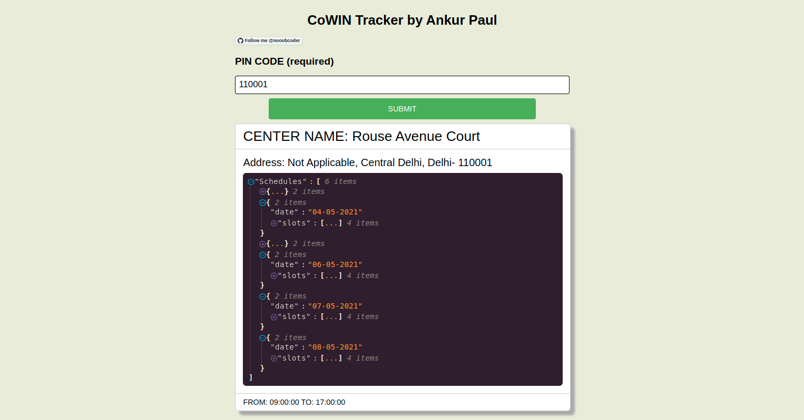

# CoWin Tracker
**Done with the CoWin Vaccination Tracker app today.**

URL 🔗: `http://cowintracker.duckdns.org/`

**Search for vaccination centers in your area with the PIN code only.**

I have used the government's API to gather data from the requests in the frontend, so they are an exact match.
This app benefits people to check vaccination centers in their location without logging into the cowin portal every time.

## Mobile Responsive View

## Desktop View

### Core Technologies User:
<ol>
<li>ReactJS (Frontend)</li>
<li>NPM</li>
<li>NodeJS (Backend)</li>
<li>Nginx</li>
<li>REST APIs</li>
<li>Docker</li>
<li>Docker Compose</li>
</ol>

### Application Softwares Used
<ol>
<li>WebStorm (Pretty much everything for development)</li>
<li>Postman (Monitor API calls)</li>
<li>Portainer (East management of cluster)</li>
</ol>

_Information about the API:_ `https://apisetu.gov.in/public/marketplace/api/cowin/cowin-protected-v2`

GitHub 🔗: `https://github.com/nooobcoder/CoWinTracker`
-Follow me on GitHub @nooobcoder
